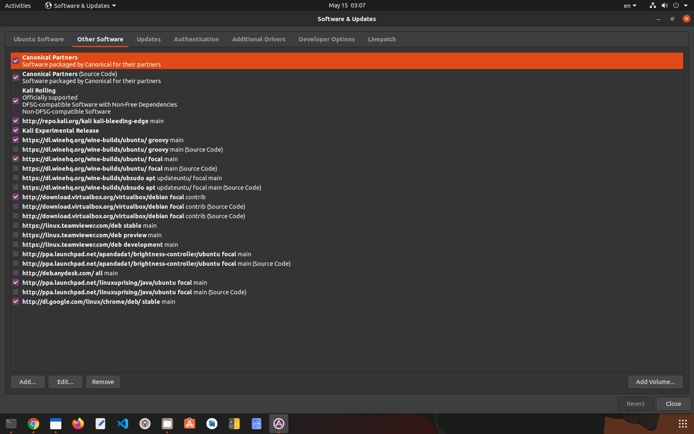

### BEFORE GOING TO TYPE COMMANDS BLINDLY MAKE SURE YOU HAVE ADDED FOLLOWING REPOSITORIES
<br/>
# DOWNLOAD VIRTUAL BOX FROM VIRTUALBOX WEBSITE
https://download.virtualbox.org/virtualbox/6.1.22/virtualbox-6.1_6.1.22-144080~Ubuntu~eoan_amd64.deb<br/>

```devender@2612:~$ sudo apt-get install libqt5opengl5-dev```<br/>

``sudo dpkg -i ~/Downloads/virtualbox-6.1_6.1.22-144080_Ubuntu_eoan_amd64.deb``<br/>
<br/>Selecting previously unselected package virtualbox-6.1.<br/>
(Reading database ... 333444 files and directories currently installed.)<br/>
Preparing to unpack .../virtualbox-6.1_6.1.22-144080_Ubuntu_eoan_amd64.deb ...<br/>
Unpacking virtualbox-6.1 (6.1.22-144080~Ubuntu~eoan) ...<br/>
Setting up virtualbox-6.1 (6.1.22-144080~Ubuntu~eoan) ...<br/>
Adding group `vboxusers' (GID 134) ...<br/>
Done.<br/>
Processing triggers for gnome-menus (3.36.0-1ubuntu1) ...<br/>
Processing triggers for desktop-file-utils (0.24-1ubuntu3) ...<br/>
Processing triggers for mime-support (3.64ubuntu1) ...<br/>
Processing triggers for hicolor-icon-theme (0.17-2) ...<br/>
Processing triggers for shared-mime-info (1.15-1) ...<br/>
devender@2612:~$ virtualbox<br/>


